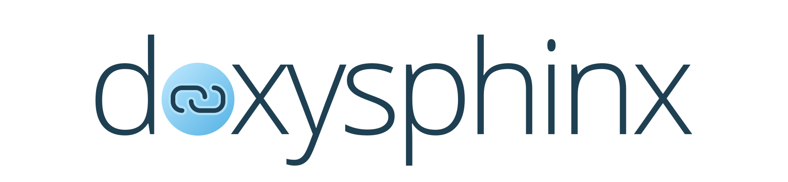

<!--
=====================================================================================
 C O P Y R I G H T
-------------------------------------------------------------------------------------
 Copyright (c) 2022 by Robert Bosch GmbH. All rights reserved.

 Author(s):
 - Markus Braun, :em engineering methods AG (contracted by Robert Bosch GmbH)
=====================================================================================
-->

---

Doxysphinx is a [Doxygen](https://doxygen.nl) and [Sphinx](https://sphinx-doc.org) integration tool.

It will make the doxygen documentation appear inside the sphinx documentation frame.

It comes as an easy-to-use cli tool and typically runs right after doxygen created it's html documentation.
Doxysphinx creates restructured text (.rst) files out of these (doxygen) html files.

Afterwards sphinx will pick up these rst files and create an integrated documentation
(theming is applied, search etc.).

## Links

📚 [Doxysphinx Overview](https://doxysphinx.github.io/)

🚀 [Getting Started](https://doxysphinx.github.io/)

💻 [Developer Quickstart](https://doxysphinx.github.io/)

🤖 [Releases](https://github.com/boschglobal/doxysphinx/releases)
