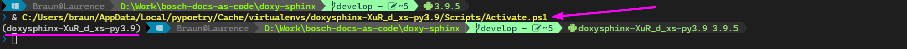

<!--
=====================================================================================
 C O P Y R I G H T
-------------------------------------------------------------------------------------
 Copyright (c) 2022 by Robert Bosch GmbH. All rights reserved.

 Author(s):
 - Markus Braun, :em engineering methods AG (contracted by Robert Bosch GmbH)
=====================================================================================
-->

# Developer Quickstart

In general, you should have [vscode](https://https://code.visualstudio.com/) installed (which is fully supported by us).

We provide a [__dev container__](https://code.visualstudio.com/docs/remote/containers) which might be a little more frictionless (because all dependencies are installed automatically in an isolated environment)
or standard __non container development__.

What is better for you comes down to your personal preferences.

## Developing in DevContainer

```{warning} if you're on windows...
You should be careful not to mount your windows filesystem into wsl2 / the devcontainer because this will be slow as hell regarding file io. This will be automatically the case if you clone your repo on a windows drive, open it in vscode and then open the devcontainer. Instead you can use one of the following approaches:

- Clone your repo in wsl2 in the native wsl2 filesystem (not beginning with `/mnt`) and open it from there: [Open a wsl2 folder in a container on Windows](https://code.visualstudio.com/docs/remote/containers#_open-a-wsl-2-folder-in-a-container-on-windows)
- Clone your repo directly in a new docker volume (which also happens to live in the wsl2 filesystem): [Open a git repository or github pr in an isolated container volume](https://code.visualstudio.com/docs/remote/containers#_quick-start-open-a-git-repository-or-github-pr-in-an-isolated-container-volume)
```

Open the repo in vscode devcontainer and follow the steps in the [](#usage) section.

## Developing natively (Windows or Linux)

This is a little more work because you need to arrange prerequisites first.

### Prerequisites

In addition to the prequisites defined in the [Getting Started Guide](getting_started.md#step-0-prerequisites) install
the following tools if you haven't them yet:

- [Poetry](https://python-poetry.org)

  ``````{card} Installation (see also <https://python-poetry.org/docs/master/#installation>)
  :margin: 1
  `````{tab-set}
  ````{tab-item} Linux/Mac
  ```bash
  curl -sSL https://install.python-poetry.org | python3 -
  ```
  ````
  ````{tab-item} Windows
  ```powershell
  (Invoke-WebRequest -Uri https://install.python-poetry.org -UseBasicParsing).Content | python -
  ```
  ````
  `````
  ``````

## Usage

::::{tab-set}
:::{tab-item} devcontainer

- open the devcontainer
  - if you installed the [devcontainer cli](https://code.visualstudio.com/docs/remote/devcontainer-cli)
    just `cd` into the repo and type:

    ```shell
    devcontainer build  # for initially building or rebuilding the devcontainer
    devcontainer open   # for opening the devcontainer directly in vscode
    ```

  - if not you can open vscode by typing:

    ```shell
    code
    ```

    When vscode opens you should see a notification asking you if you want to reload vscode in devcontainer - acknowledge it.
    (If that's not working keep sure that you installed the [remote container extension](https://marketplace.visualstudio.com/items?itemName=ms-vscode-remote.remote-containers) in vscode on your host).

:::

:::{tab-item} native development (windows, linux, etc.)

- Open the repo in vscode
- __On first start:__ install poetry packages and precommit hooks with vscode terminal (may take some time)

  ```shell
  poetry install
  poetry run pre-commit install --install-hooks
  ```

- in vscode select the python interpreter (Command Palette -> Python: Select Interpreter - if the poetry virtual env created before isn't shown restart vscode and retry)

:::

::::

- now you're ready to develop
  - you can just hit F5 and should be able to debug into the code
  - you can also use the testrunner to run the unittests
    (or write some more for all the great features you're implementing now 😉)
  - in vscode there are some tasks defined to manually run the precommit, lint etc. (usually you won't need
    that if you installed precommit hooks)

- For testing the doxysphinx cli you can also run it directly in the vscode terminal:

  ```shell
  poetry run doxysphinx <args...>
  ```

- For just generating docs you can use the normal sphinx makefile mechanisms (A user would also do the same):

  ```shell
  make html # build complete documentation (doxygen, doxysphinx, sphinx)
  make help # show commands
  make clean # cleanup
  make [doxygen|doxysphinx|sphinx] # run steps separately
  ```

  You can then see the generated documentation by opening `.build/html/index.html`.

## Updating dependencies

If you want to update the projects dependencies do the following:

- checkin/stash all your local changes (so you could reverse easily and see the differences quite easy)
- update your dependencies:

  ```shell
  poetry up --latest --without ci
  ```

- review the updates e.g. in vscode with git diff
- test everything 😄

## Troubleshooting

### Module not found errors

If you get module not found errors, e.g. when running doxysphinx or sphinx the problem might be the vscode terminal. Sometimes vscode isn't activating the poetry virtualenv correctly in terminal (even if the rest of vscode is working). The solution is then to just restart the terminal (note that in the devcontainer you should use the zsh terminal).



Watch out for an venv activate script call or for the changed command prompt (the venv name should be at the beginning of the prompt).

## Pycharm usage

:::{hint}
Should be the same for Intellij Idea.
:::

While we recommend using vscode there are times when pycharm may be a better fit/ may be better suited for some dev
tasks.

When opening the project in pycharm you may need to select the poetry executable. Under Windows this is installed in
`%USERPROFILE%\AppData\Roaming\Python\Scripts\poetry.exe`
(This path is as the time of this writing documented wrong in the poetry documentation so we mentioned that here).

Initialization will take some time in pycharm (especially when indexing the python sdk) so please be patient until
everything is set up (watch the right side of the pycharm status bar).

### Makefile targets under Windows

We provide the makefile targets as run configurations. As Make is no standard tool under windows you would need to
install it (e.g. via chocolatey "choco install make"), and afterwards configure it in Pycharm under
`File->Settings->Build, Execution, Deployment->Build Tools->Make->Path to Make executable`.
